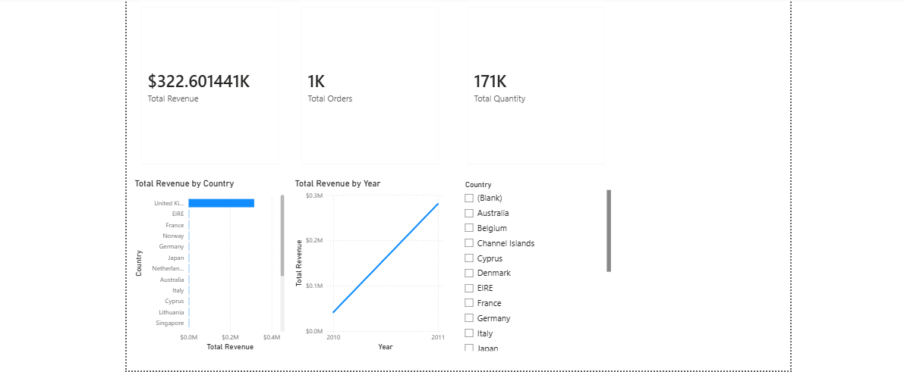
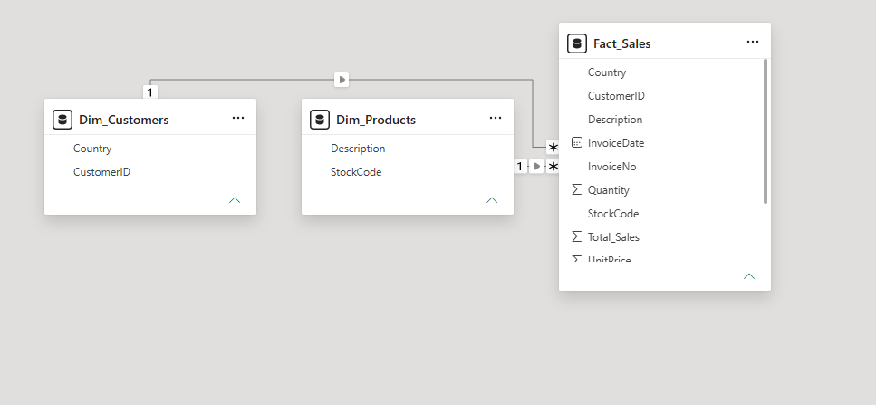

# ECommerce-Retail-PowerBI-Analytics
End-to-end data engineering and retail analytics dashboard using Power BI.
# Enterprise E-Commerce Retail Analytics Dashboard (Power BI)

## 📌 Project Overview
An end-to-end Data Engineering and Business Intelligence project utilizing the **UCI Online Retail Dataset** (540k+ rows). The goal was to transform a flat, denormalized transactional dataset into an optimized, enterprise-grade **Star Schema** data model to deliver actionable insights on global sales, order frequencies, and geographical performance.

## 📊 Dashboard Preview
Here is a complete look at the final interactive dashboard:

---

## 🛠️ Tech Stack
* **BI Platform:** Power BI Desktop
* **ETL & Data Engineering:** Power Query (M Language)
* **Analytical Computations:** DAX (Data Analysis Expressions)
* **Data Modeling:** Star Schema Design

## 🏗️ Data Architecture & Modeling (Star Schema)
To optimize query performance and filter propagation, the flat source file was engineered into a clean Star Schema model:

1. **Fact_Sales:** Contains transactional metrics (`Quantity`, `UnitPrice`, and calculated `Total_Sales`).
2. **Dim_Products:** Cleaned product master data utilizing `StockCode` as a unique primary key (Case-sensitivity & trailing spaces resolved via Trim & Upper operations).
3. **Dim_Customers:** Customer profiling linked by unique `CustomerID` tracking global markets.

## 📈 Key Insights & Features Delivered
* **Total Revenue Management:** Dynamic KPI card tracking global sales.
* **Geographical Sales Distribution:** Horizontal bar chart comparing country-level revenue performance.
* **Temporal Trend Analysis:** Line chart forecasting and exploring sales velocity across financial periods.
* **Interactive Slicers:** Country-level dynamic filters providing sub-second analytical drilling.
